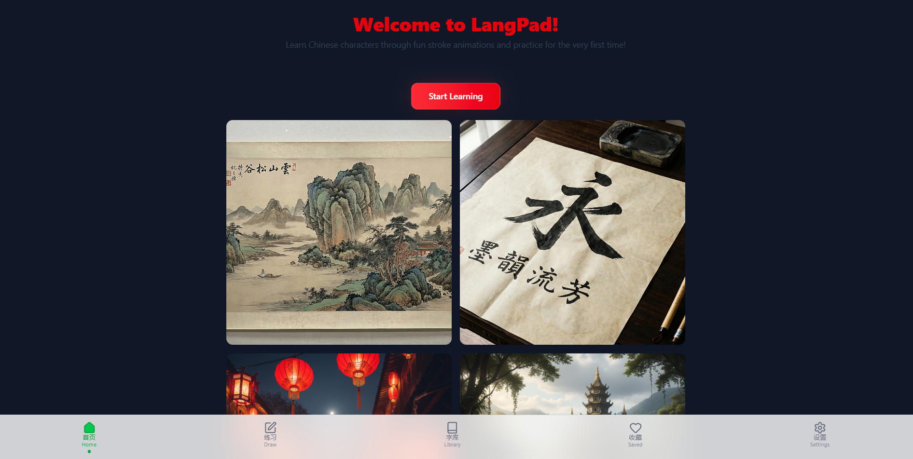
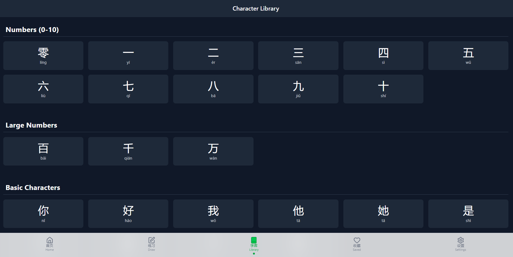
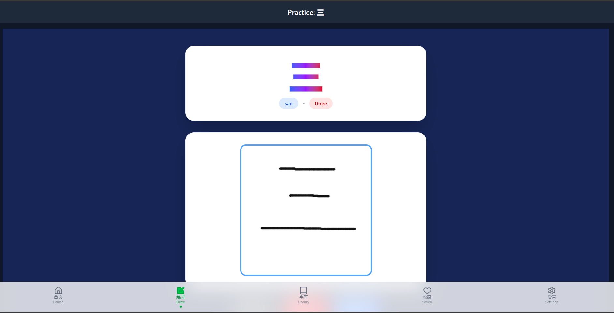
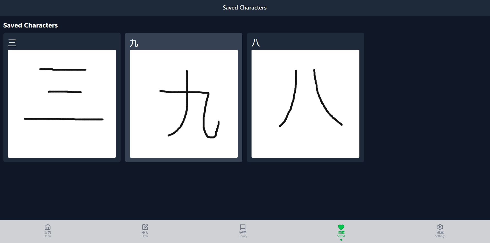

# 🎨 LangPad – Learn Chinese Characters Interactively

[](https://reactjs.org/)
[](https://www.typescriptlang.org/)
[](https://tailwindcss.com/)
[](https://opensource.org/licenses/MIT)

Welcome to **LangPad**, an interactive platform for learning Chinese characters with stroke order animations, practice sessions, and a growing character library.

---

## 🌟 Features

- **Interactive Drawing Pad** ✍️  
  Practice writing Chinese characters with real-time stroke order guidance.

- **Stroke Order Animations** 🔄  
  Learn the proper order of strokes with smooth, animated guidance.

- **Character Library** 📚  
  Browse, search, and filter thousands of Chinese characters by difficulty, category, or stroke count.

- **Save Your Progress** 💾  
  Keep track of your practiced characters with saved drawings and scores.

- **Audio Pronunciation** 🔊  
  Hear the correct pronunciation for each character.

- **Responsive Design** 📱💻  
  Works seamlessly on desktop, tablet, and mobile devices.

---

## 🖼️ Screenshots

<div align="center">
  
  
  
  
</div>

---

## 🚀 Getting Started

### Prerequisites

- Node.js >= 18.x  
- npm or yarn  
- Modern browser (Chrome, Edge, Firefox, Safari)

### Installation

```bash
# Clone the repository
git clone https://github.com/yourusername/langpad.git
cd langpad

# Install dependencies
npm install

npm start
# or
yarn start

# or
yarn install
